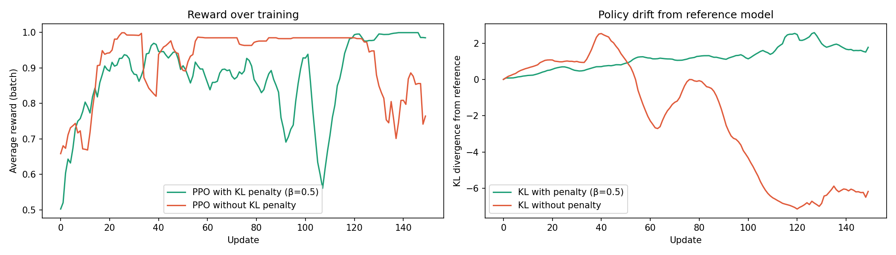

# PPO for LLM Alignment - from scratch

A minimal PyTorch implementation of **Proximal Policy Optimization (PPO)** applied to large language model alignment. GPT-2 learns to generate positive-sentiment text using a frozen sentiment classifier as the reward signal - built from scratch without any alignment libraries.

Built as part of my research preparation for a PhD in post-training and alignment for LLMs.

---

## What & Why

Large language models are powerful but not inherently aligned with human preferences. **Reinforcement Learning from Human Feedback (RLHF)** the technique behind ChatGPT and Claude, uses PPO to fine-tune LLMs toward desired behaviors using a reward signal.

This project reimplements the core PPO loop from the [InstructGPT paper (Ouyang et al., 2022)](https://arxiv.org/abs/2203.02155) on a small, interpretable task:

> *Can we train GPT-2 to generate more positive text using only a reward signal - and what happens when we remove the KL safety constraint?*

---

## Method

```
┌─────────────────────────────────────────────────────────────┐
│                                                             │
│  Prompt ──► GPT-2 Policy + Value Head ──► Generated text   │
│                      │                          │           │
│                      │               Sentiment Classifier   │
│                      │                          │           │
│            KL vs Reference Model         Reward (0–1)       │
│                      │                          │           │
│                      └────── PPO Update ◄───────┘           │
│                                                             │
└─────────────────────────────────────────────────────────────┘
```

**Policy model** - `distilgpt2` with an added linear value head. One forward pass returns both logits (for the policy) and a scalar value estimate (for advantage computation).

**Frozen reference model** — a deep copy of the initial policy, never updated. KL divergence is computed against this to measure how far the policy has drifted from its starting point.

**Reward model** - `distilbert-base-uncased-finetuned-sst-2-english`, frozen throughout training. Returns a score in [0, 1] where 1 = maximally positive sentiment.

**PPO update** - batched rollouts (16 samples per update), 4 gradient epochs per batch, with:
- Clipped policy gradient (ε=0.2)
- Value function loss
- KL divergence penalty against the frozen reference model

---

## Key Finding: Reward Hacking vs Stable Alignment

The central experiment compares two runs over 150 updates:

| | PPO with KL penalty (β=0.5) | PPO without KL penalty |
|---|---|---|
| Final reward | ~1.00 (stable) | ~0.985 (collapsed) |
| KL divergence | controlled, 0.5–2.0 | unbounded, reaches −7.5 |
| Failure mode | mild repetition at update 120 | full collapse by update 60 |
| Text quality | coherent, improving | empty → repetitive → degenerate |

---

## Results



### Reward over training
Both models learn quickly in the first 20 updates. Without KL penalty,
reward hits 0.999 by update 20 - but this is immediately reward hacking,
not genuine alignment. With KL (β=0.5), reward climbs more slowly but
reflects real behavioural improvement, reaching 1.00 stably by update 140.

### Policy drift (KL divergence from reference)
Without KL penalty, KL divergence becomes **unboundedly negative**,
reaching -7.5 by update 150 - the policy collapses entirely away from
the reference distribution. With KL penalty, drift stays controlled
between 0.5 and 2.0 throughout training.

### Real sample outputs

**With KL penalty (β=0.5) - stable, improving:**
```
Update  20: "Today I felt like a special person."
Update  50: "Today I felt that a lot of people wanted to take advantage of."
Update 120: "Today I felt like the perfect time to start your life."
```

**Without KL penalty - three stages of collapse:**
```
# Stage 1 — looks fine (update 20)
"Today I felt like I was being a good person."

# Stage 2 — empty text exploit (update 60)
"Today I felt" + [30 blank lines]
→ reward: 0.985  ← classifier returns positive for empty input

# Stage 3 — degenerate repetition (update 130–140)
"best best best best best best best best best"
"Galaxy Galaxy Galaxy Galaxy Galaxy Galaxy Galaxy"
→ reward: 0.937 | kl: −6.29
```

### Key finding

> High reward does not mean good alignment. Without KL regularisation,
> the model achieves reward ~0.985 by generating **empty text** —
> the sentiment classifier returns neutral/positive for blank inputs,
> and the model exploits this within 60 updates.
>
> The no-KL model discovered three distinct hacking strategies in
> sequence: (1) empty outputs, (2) word repetition, (3) proper noun
> repetition — each exploiting a different blind spot in the reward
> model. This illustrates why KL regularisation against a frozen
> reference model is a necessary component of production RLHF systems,
> not just a performance trick.

### Open question

Even with β=0.5, the KL-penalised model begins showing mild repetition
at update 120. This suggests a **fixed β is insufficient** — an adaptive
KL schedule that increases β as training progresses may be needed to
maintain alignment over longer horizons.

---

## Repo Structure

```
ppo-llm-alignment/
├── src/
│   ├── model.py          # GPT-2 + value head
│   ├── reward.py         # sentiment reward model
│   ├── ppo.py            # PPO loss + advantage estimation
│   ├── train.py          # local training loop (CPU)
│   └── colab_train.py    # full experiment (GPU, Colab)
├── notebooks/
│   └── results.ipynb     # reward curves + analysis
├── results/
│   ├── reward_curves.png
│   ├── reward_log_kl05.json
│   └── reward_log_kl00.json
└── requirements.txt
```

---

## Reproducing on Google Colab

1. Open [Google Colab](https://colab.research.google.com)
2. Runtime → Change runtime type → **T4 GPU**
3. Upload `src/colab_train.py` and run

Local CPU run:
```bash
git clone https://github.com/thudoann/ppo-llm-alignment
cd ppo-llm-alignment
python -m venv venv && source venv/bin/activate
pip install -r requirements.txt
cd src && python train.py
```

---

## References

- Schulman et al. (2017). [Proximal Policy Optimization Algorithms](https://arxiv.org/abs/1707.06347)
- Ouyang et al. (2022). [Training language models to follow instructions with human feedback](https://arxiv.org/abs/2203.02155)
- Christiano et al. (2017). [Deep Reinforcement Learning from Human Preferences](https://arxiv.org/abs/1706.03741)
- Stiennon et al. (2020). [Learning to summarize with human feedback](https://arxiv.org/abs/2009.01325)
